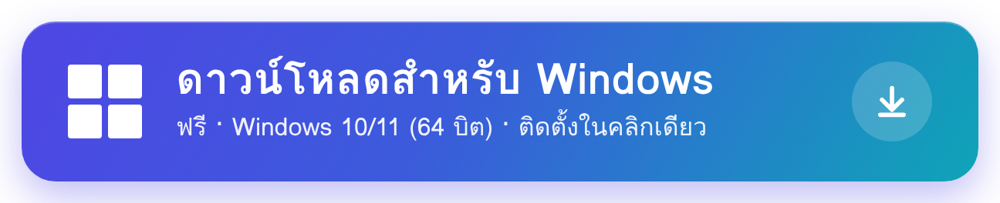
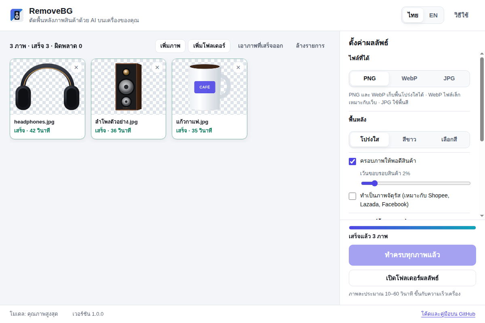
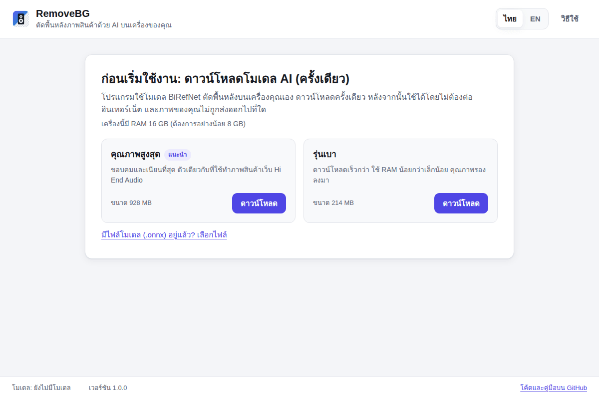
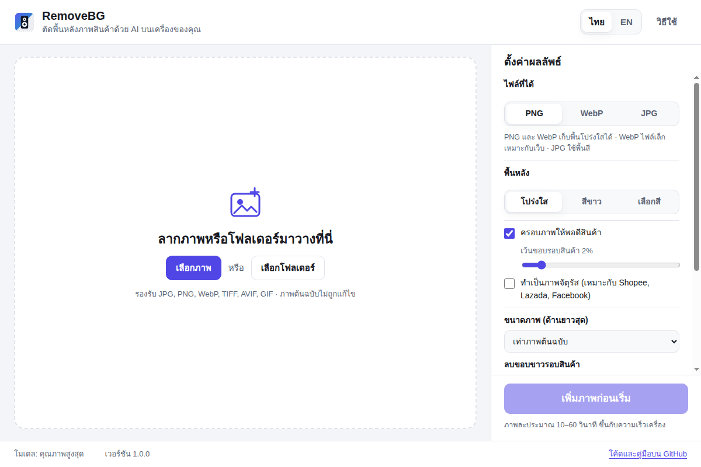
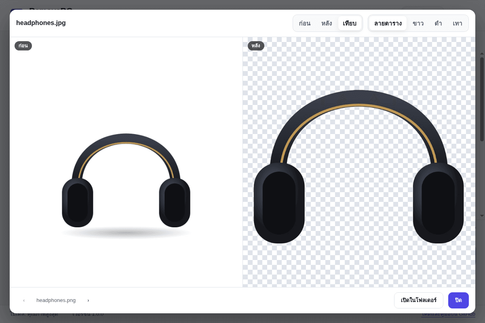
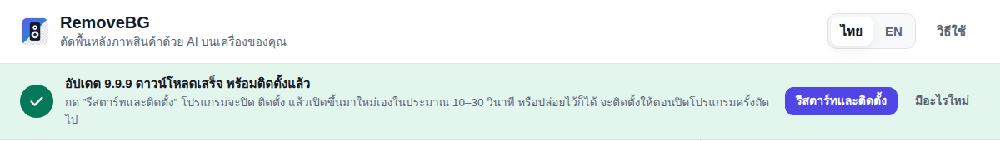

<div align="center">


# RemoveBG

**ตัดพื้นหลังภาพสินค้าด้วย AI บนเครื่องของคุณ**<br>
ฟรี · ไม่ต้องสมัคร · ไม่ส่งภาพขึ้นอินเทอร์เน็ต · หน้าจอภาษาไทย

<br>

<a href="https://github.com/golfkung001/RemoveBG/releases/latest/download/RemoveBG-Setup.exe"></a>

<sub><a href="https://github.com/golfkung001/RemoveBG/releases">ทุกเวอร์ชันและรายละเอียดการเปลี่ยนแปลง</a> · <a href="#ติดตั้ง-3-ขั้นตอน">วิธีติดตั้ง</a> · <a href="#แก้ปัญหา">แก้ปัญหา</a> · <a href="#สำหรับนักพัฒนา-english">English</a></sub>

<br><br>

[](https://github.com/golfkung001/RemoveBG/releases/latest)
[](https://github.com/golfkung001/RemoveBG/releases)
[](#สิ่งที่ต้องมี)
[](https://github.com/golfkung001/RemoveBG/actions/workflows/build.yml)
[](LICENSE)

</div>

---

โปรแกรม Windows สำหรับลบพื้นหลังภาพสินค้า ลากภาพเข้ามาแล้วกดปุ่มเดียว ได้ภาพพื้นโปร่งใส (PNG/WebP) หรือพื้นสีขาว/สีที่เลือก (JPG) ทีละหลายภาพ
ใช้โมเดล AI **BiRefNet** วิธีเดียวกับที่ใช้ทำภาพสินค้าทั้งหมดของเว็บ Hi End Audio

- ทำงานบนเครื่องคุณเอง **ไม่ต้องสมัคร ไม่มีค่าใช้จ่าย ไม่ส่งภาพขึ้นอินเทอร์เน็ต**
- ใช้อินเทอร์เน็ตครั้งเดียวตอนดาวน์โหลดโมเดล หลังจากนั้นใช้งานออฟไลน์ได้
- ภาพต้นฉบับไม่ถูกแก้ไข ผลลัพธ์บันทึกเป็นไฟล์ใหม่เสมอ
- หน้าจอภาษาไทยและอังกฤษ



---

## สิ่งที่ต้องมี

| | |
|---|---|
| ระบบ | Windows 10 หรือ 11 แบบ 64 บิต |
| หน่วยความจำ (RAM) | อย่างน้อย 8 GB (แนะนำ 16 GB) |
| พื้นที่ว่าง | ประมาณ 1.5 GB (ตัวโปรแกรม + โมเดล AI) |
| อินเทอร์เน็ต | ครั้งแรกครั้งเดียว เพื่อดาวน์โหลดโมเดล (215 MB หรือ 930 MB) |

## ติดตั้ง (3 ขั้นตอน)

1. กดปุ่ม **ดาวน์โหลดสำหรับ Windows** ด้านบน จะได้ไฟล์ **`RemoveBG-Setup.exe`** (หรือเปิดหน้า [Releases](https://github.com/golfkung001/RemoveBG/releases/latest) แล้วเลือกไฟล์ในหัวข้อ Assets)
2. ดับเบิลคลิกไฟล์ที่ดาวน์โหลดมา
   ถ้าขึ้นหน้าต่างสีน้ำเงิน **"Windows protected your PC"** ให้กด **More info (ข้อมูลเพิ่มเติม)** แล้วกด **Run anyway (เรียกใช้ต่อไป)**
   หน้าต่างนี้ขึ้นเพราะโปรแกรมยังไม่ได้ซื้อใบรับรองดิจิทัลจาก Microsoft ไม่ได้แปลว่ามีไวรัส ตรวจสอบได้ว่าไฟล์ตรงกับที่ GitHub สร้างจากค่า SHA-256 ในไฟล์ `SHA256SUMS.txt` ในหน้า Releases
3. โปรแกรมติดตั้งเสร็จเองในไม่กี่วินาที (ไม่ต้องใช้สิทธิ์ผู้ดูแลระบบ) แล้วจะเปิดขึ้นมาให้ทันที ครั้งต่อไปเปิดจากไอคอน **RemoveBG** บน Desktop หรือเมนู Start

## เปิดครั้งแรก: ดาวน์โหลดโมเดล AI

เลือกได้ 1 แบบ (ติดตั้งทั้งสองแบบแล้วสลับใช้ได้ในเมนู "ตั้งค่าขั้นสูง")

| | คุณภาพสูงสุด (แนะนำ) | รุ่นเบา |
|---|---|---|
| ขนาดดาวน์โหลด | ประมาณ 930 MB | ประมาณ 215 MB |
| คุณภาพขอบ | คมและเนียนที่สุด | รองลงมาเล็กน้อย |
| เหมาะกับ | เครื่อง RAM 12 GB ขึ้นไป | เครื่อง RAM 8 GB หรืออินเทอร์เน็ตช้า |

กด **ดาวน์โหลด** แล้วรอจนเสร็จ ถ้าอินเทอร์เน็ตหลุดกลางทาง กดดาวน์โหลดอีกครั้ง โปรแกรมจะโหลดต่อจากเดิม ไม่ต้องเริ่มใหม่
เมื่อโหลดเสร็จ โปรแกรมจะตรวจว่าไฟล์ครบและไม่เสียหาย (SHA-256) ก่อนใช้งาน



> ถ้าเครื่องที่จะใช้ไม่มีอินเทอร์เน็ต: ดาวน์โหลดไฟล์โมเดลจากเครื่องอื่น ([คุณภาพสูงสุด](https://github.com/danielgatis/rembg/releases/download/v0.0.0/BiRefNet-general-epoch_244.onnx) / [รุ่นเบา](https://github.com/danielgatis/rembg/releases/download/v0.0.0/BiRefNet-general-bb_swin_v1_tiny-epoch_232.onnx)) ใส่แฟลชไดรฟ์ แล้วกด **"มีไฟล์โมเดล (.onnx) อยู่แล้ว? เลือกไฟล์"**

## วิธีใช้



1. **ใส่ภาพ:** ลากภาพหรือทั้งโฟลเดอร์มาวางในกรอบ หรือกด **เลือกภาพ** / **เลือกโฟลเดอร์** (เลือกโฟลเดอร์แล้วจะรวมภาพในโฟลเดอร์ย่อยด้วย)
2. **เลือกผลลัพธ์** ที่แผงด้านขวา (ค่าเริ่มต้นใช้ได้เลย):

   | ตัวเลือก | ความหมาย |
   |---|---|
   | ไฟล์ที่ได้ | **PNG** พื้นโปร่งใส ใช้ได้ทุกที่ · **WebP** พื้นโปร่งใส ไฟล์เล็ก เหมาะกับเว็บ · **JPG** พื้นสี ไฟล์เล็ก |
   | พื้นหลัง | โปร่งใส / สีขาว / เลือกสีเอง |
   | ครอบภาพให้พอดีสินค้า | ตัดพื้นที่ว่างรอบสินค้าออก และเว้นขอบตามที่ตั้ง (ค่าเริ่มต้น 2%) |
   | ทำเป็นภาพจัตุรัส | วางสินค้ากลางภาพสี่เหลี่ยมจัตุรัส เหมาะกับ Shopee, Lazada, Facebook |
   | ขนาดภาพ | ย่อด้านยาวสุดให้ไม่เกินที่เลือก (ไม่ขยายภาพเล็ก) |
   | ลบขอบขาวรอบสินค้า | ลบเส้นขาวจาง ๆ รอบสินค้าที่ถ่ายบนพื้นขาว ทำให้วางบนพื้นสีเข้มได้สวย "อัตโนมัติ" จะทำเฉพาะภาพที่ถ่ายบนพื้นขาว |
   | บันทึกที่ | โฟลเดอร์ `RemoveBG` ข้างภาพต้นฉบับ หรือโฟลเดอร์ที่เลือกเอง |

3. กด **เริ่มตัดพื้นหลัง** ใช้เวลาภาพละประมาณ 10–60 วินาที ขึ้นกับความเร็วเครื่อง ทำงานต่อได้ระหว่างรอ และกด **หยุด** ได้ทุกเมื่อ
4. คลิกภาพเพื่อเทียบ **ก่อน / หลัง** บนพื้นลายตาราง ขาว ดำ หรือเทา แล้วกด **เปิดในโฟลเดอร์** เพื่อเอาไฟล์ไปใช้



ชื่อไฟล์ผลลัพธ์จะเหมือนภาพต้นฉบับ เช่น `ลำโพง.jpg` → `RemoveBG\ลำโพง.png` ถ้ามีไฟล์ชื่อนี้อยู่แล้วจะตั้งเป็น `ลำโพง (2).png` ไม่เขียนทับไฟล์เดิม

## เคล็ดลับให้ได้ผลสวย

- ภาพที่ถ่ายบนพื้นเรียบสีเดียว แสงสม่ำเสมอ ให้ผลดีที่สุด
- ใช้ภาพความละเอียดสูง (ด้านยาว 1,500 พิกเซลขึ้นไป) ขอบจะคมกว่า
- สินค้าใส (แก้ว อะคริลิก) สายเคเบิลเส้นเล็ก และชั้นวางแบบโปร่ง ควรเปิดดูผลทุกภาพก่อนนำไปใช้
- เงาบนพื้นใต้สินค้ามักถูกลบไปด้วย ถ้าต้องการเงา ให้เพิ่มเงาในโปรแกรมแต่งภาพภายหลัง

## แก้ปัญหา

| อาการ | วิธีแก้ |
|---|---|
| ขึ้นว่า "หน่วยความจำไม่พอ" | ปิดโปรแกรมอื่น (โดยเฉพาะเบราว์เซอร์ที่เปิดหลายแท็บ) แล้วกดลองใหม่ หรือเปลี่ยนเป็นรุ่นเบาใน "ตั้งค่าขั้นสูง" |
| ช้ามาก | ปกติภาพละไม่เกิน 1 นาที ถ้ามีการ์ดจอแยก ลองเปิด "ใช้การ์ดจอช่วย" ใน "ตั้งค่าขั้นสูง" (ถ้าการ์ดจอไม่รองรับ โปรแกรมจะกลับไปใช้ CPU เอง) |
| ดาวน์โหลดโมเดลไม่ผ่าน | ตรวจอินเทอร์เน็ตแล้วกดดาวน์โหลดใหม่ (โหลดต่อจากเดิม) หรือใช้วิธีเลือกไฟล์โมเดลด้านบน |
| ไม่พบวัตถุในภาพ | ภาพไม่มีวัตถุเด่นชัด หรือเป็นภาพฉากทั้งภาพ ลองครอปให้สินค้าเด่นขึ้นก่อน |
| Windows ไม่ยอมเปิดตัวติดตั้ง | ดูขั้นตอนที่ 2 ของการติดตั้ง (More info → Run anyway) |

## อัปเดตโปรแกรม

โปรแกรมตรวจหาเวอร์ชันใหม่เองทุกครั้งที่เปิด (และทุก 6 ชั่วโมง) หรือกด **ตรวจหาอัปเดต** ที่แถบล่างของหน้าต่าง

1. มีเวอร์ชันใหม่ จะมีแถบแจ้งด้านบน กด **ดาวน์โหลดอัปเดต** (กด "มีอะไรใหม่" เพื่อดูรายละเอียดก่อนได้)
2. ระหว่างดาวน์โหลดจะเห็นเปอร์เซ็นต์ ขนาด และความเร็ว ใช้โปรแกรมต่อได้ตามปกติ
3. ดาวน์โหลดเสร็จ แถบจะเป็นสีเขียว กด **รีสตาร์ทและติดตั้ง** โปรแกรมจะปิด ติดตั้ง แล้วเปิดขึ้นมาใหม่เองในประมาณ 10–30 วินาที (ถ้ากำลังตัดภาพอยู่ จะติดตั้งได้เมื่อทำเสร็จ) หรือปล่อยไว้ก็ได้ จะติดตั้งให้ตอนปิดโปรแกรมครั้งถัดไป
4. เปิดขึ้นมาใหม่จะมีแถบ **"อัปเดตเป็นเวอร์ชัน … เรียบร้อยแล้ว"** ยืนยัน

ภาพ โมเดล AI และการตั้งค่ายังอยู่ครบหลังอัปเดต ปิดการตรวจอัตโนมัติได้ที่ "ตั้งค่าขั้นสูง"



## ถอนการติดตั้ง

ไปที่ **Settings → Apps → Installed apps → RemoveBG → Uninstall**
โมเดล AI และการตั้งค่าจะยังอยู่ (ติดตั้งใหม่ไม่ต้องดาวน์โหลดซ้ำ) ถ้าต้องการลบให้หมดเพื่อคืนพื้นที่ประมาณ 1 GB ให้ลบโฟลเดอร์ `%APPDATA%\RemoveBG` (กดปุ่ม "เปิดโฟลเดอร์ข้อมูลโปรแกรม" ใน "ตั้งค่าขั้นสูง" ก่อนถอนการติดตั้งเพื่อดูตำแหน่ง)
ภาพผลลัพธ์ในโฟลเดอร์ `RemoveBG` ของคุณไม่ถูกลบ

## ความเป็นส่วนตัว

ภาพทั้งหมดประมวลผลบนเครื่องคุณ โปรแกรมเชื่อมต่ออินเทอร์เน็ตเฉพาะตอนดาวน์โหลดโมเดลจาก GitHub (`github.com/danielgatis/rembg/releases`) ตอนตรวจหาและดาวน์โหลดอัปเดตจากหน้า Releases ของโปรแกรมนี้ และเมื่อคุณกดลิงก์ไปหน้า GitHub ไม่มีการเก็บสถิติหรือส่งข้อมูลการใช้งาน

---

## วิธีตัดพื้นหลัง (มาจากงานจริง)

ขั้นตอนเดียวกับที่ใช้ตัดภาพสินค้า 177 ภาพของเว็บ Hi End Audio:

1. **BiRefNet-general** (หรือรุ่น lite) ทำนายหน้ากาก (mask) ที่ 1024×1024 พิกเซล ขั้นเตรียมภาพและแปลงผลตรงกับ [rembg](https://github.com/danielgatis/rembg) เมื่อเทียบกับ rembg บนภาพเดียวกัน ค่าเฉลี่ยต่างกัน 0.5 จาก 255 (ต่างเฉพาะตามขอบ จากวิธีย่อขยายภาพ)
2. ค่าความโปร่งใสที่เกือบทึบ (≥ 248) ปัดเป็นทึบ และที่เกือบใส (≤ 6) ปัดเป็นใส ตัวสินค้าจึงไม่โปร่งทะลุ และไม่มีฝ้ารอบสินค้า
3. ภาพถ่ายบนพื้นขาว: หักสีขาวที่ปนอยู่ในพิกเซลขอบกึ่งโปร่งใสออก สินค้าจึงไม่มีขอบขาวเมื่อวางบนพื้นเข้ม
4. ครอบให้พอดีสินค้า เว้นขอบ ทำจัตุรัส ย่อขนาด และบันทึกเป็น PNG / WebP / JPG

## สำหรับนักพัฒนา (English)

RemoveBG is an Electron app. The model runs with [onnxruntime-node](https://www.npmjs.com/package/onnxruntime-node) in a separate utility process, so the window stays responsive and running out of memory cannot take the app down. Images are handled by [sharp](https://sharp.pixelplumbing.com/). No Python is needed.

```
src/core/cutout.js    pre/post-processing (rembg-compatible BiRefNet I/O, alpha snap, white de-fringe, trim, encode)
src/core/engine.js    ONNX Runtime session (CPU, or DirectML on Windows when enabled)
src/main/main.js      window, IPC, queue, model download, packaged --self-test
src/main/worker.js    the AI process
src/main/models.js    model list (URL, size, MD5, SHA-256), resumable verified download
src/main/files.js     finding photos, naming results (never overwrites)
src/main/settings.js  settings in %APPDATA%\RemoveBG\settings.json
src/main/updater.js   update checks through GitHub Releases (electron-updater): announce, download with progress, restart to install
src/renderer/         the window (no framework, strict CSP, preload bridge only)
src/assets/self-test-model.onnx   224-byte stand-in model for tests (tools/make-test-model.py)
```

```bash
npm ci            # .npmrc skips onnxruntime-node's optional CUDA download
npm test          # unit + end-to-end with the stand-in model
REMOVEBG_MODEL=/path/to/birefnet-general.onnx npm test   # also runs the real model
npm start         # run the app
npm run dist      # Windows installer in dist/ (run on Windows)
```

Notes:
- Peak memory while a photo is processed is about 6.5 GB (lite) to 8 GB (best quality), because BiRefNet works at a fixed 1024×1024.
- `enableMemPattern` is off in the ONNX Runtime session: with it on, the second photo in the same Electron process crashes (the allocator refuses one huge block). Covered by the worker test (two photos in a row).
- `REMOVEBG_USER_DATA=<dir>` uses another data folder (tests); `REMOVEBG_DEBUG=<file>` writes the AI process output to a file; `REMOVEBG_FAKE_UPDATE=available|latest|error` (development runs only) plays the update screens without a release.
- Updates: the installed app reads `latest.yml` from the latest GitHub Release, downloads only when the user agrees, and installs on "Restart and install" or when the app closes. The first start of a new version shows "Updated to version …".
- `RemoveBG.exe --self-test=<result.json>` checks, inside the installed app, that the image library and ONNX Runtime load and cut out a test image with the stand-in model. CI runs it on the packaged and on the installed app.

### Releases

[`.github/workflows/build.yml`](.github/workflows/build.yml) runs on every push and pull request on `windows-latest`: tests, installer build, self-test of the packaged app, silent install and self-test of the installed app. The installer is attached to the run as an artifact.
To publish a release: set `version` in `package.json`, merge to `main`, then push a tag `vX.Y.Z` with the same version. The workflow attaches `RemoveBG-Setup-X.Y.Z.exe`, the same file as `RemoveBG-Setup.exe` (the stable name the download button links to through `releases/latest/download/`), and `SHA256SUMS.txt` to a GitHub Release.
The installer is not code-signed, so Windows SmartScreen asks for confirmation (see Install, step 2).

## License and credits

RemoveBG is released under the [MIT License](LICENSE).
It uses BiRefNet ([ZhengPeng7/BiRefNet](https://github.com/ZhengPeng7/BiRefNet), MIT) with the ONNX exports published by [rembg](https://github.com/danielgatis/rembg) (MIT), ONNX Runtime (MIT), sharp/libvips and Electron. See [THIRD_PARTY_NOTICES.md](THIRD_PARTY_NOTICES.md).
